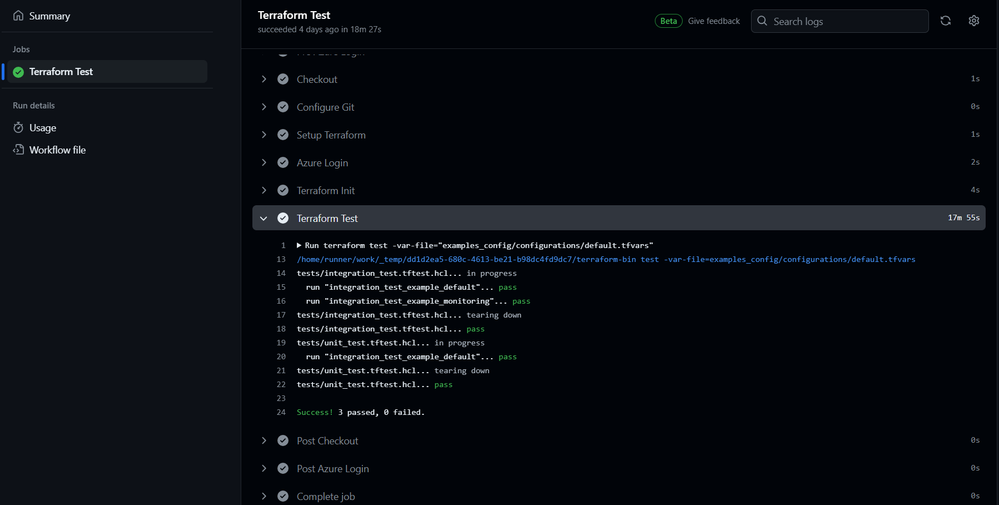
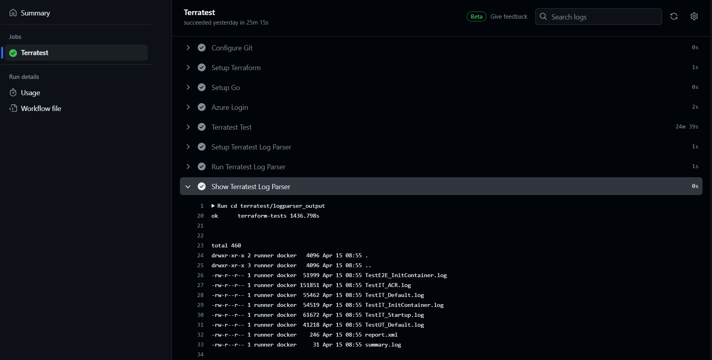

# Terraform Testing <!-- omit in toc -->

This repository showcases different levels of testing for Infrastructure as Code using Terraform. Within the test directories, there are examples of Unit, Integration, and End-To-End tests employing both Terraform's built-in testing feature and the Terratest tool.

## Table of Contents <!-- omit in toc -->
- [Module Container App](#module-container-app)
- [Testing tools](#testing-tools)
- [Recording test results](#recording-test-results)
- [Deploy examples](#deploy-examples)

## Module Container App

Tests are conducted on a module serving as an illustrative example. This module represents an Azure Container App and is based after Microsoft's examples:

- [Azure Container Apps overview | Microsoft Learn](https://learn.microsoft.com/en-gb/azure/container-apps/overview).  
- Example in [Azure/terraform-azure-container-apps: A Terraform module to deploy a container app in Azure (github.com)](https://github.com/Azure/terraform-azure-container-apps)
  - This example uses workflows and scripts from [tfmod-scaffold/scripts at main · Azure/tfmod-scaffold (github.com)](https://github.com/Azure/tfmod-scaffold/tree/main/scripts)

## Testing tools

### Terraform Tests

- Official documentation: [Write Terraform Tests | Terraform | HashiCorp Developer](https://developer.hashicorp.com/terraform/tutorials/configuration-language/test)
- Code directory: [tests](tests/)
- Workflow file: [terraform_tests.yaml](.github/workflows/terraform_tests.yaml)

Example output from GitHub Actions:


### Terratest

- Official documentation:
  - [Quick start (gruntwork.io)](https://terratest.gruntwork.io/docs/getting-started/quick-start/)
  - [terratest/test/terraform_basic_example_test.go at master · gruntwork-io/terratest (github.com)](https://github.com/gruntwork-io/terratest/blob/master/test/terraform_basic_example_test.go)
  - [Debugging interleaved test output (gruntwork.io)](https://terratest.gruntwork.io/docs/testing-best-practices/debugging-interleaved-test-output/)
- Code directory: [terratest](terratest/)
- Workflow file: [terratest.yaml](.github/workflows/terratest.yaml)

Example output from GitHub Actions:


## Recording test results

In certain scenarios, it could be beneficial to maintain a record of the test outcomes for each example whenever new releases occur. This practice becomes particularly relevant in cases where there might be bugs in the Terraform provider or certain edge cases that are safe to ignore but they should be tracked. For instance, this can be done by adding the file `examples_cases/acr/TestRecord.md` that includes the date, release version, indication of test success, and any encountered errors, if applicable.

This documentation can be supplemented by a `docs/CHANGELOG.md` file outlining the modifications made in each release version, providing insight into the reasons behind the changes and test results.


## Deploy examples

### Workflows Approve deployments (TO-DO)

- [GitHub Actions: Terraform deployments with a review of planned changes](https://itnext.io/github-actions-terraform-deployments-with-a-review-of-planned-changes-30143358bb5c)
- [Reviewing deployments](https://docs.github.com/en/actions/managing-workflow-runs/reviewing-deployments)

### Manually deploy examples

```bash
export ARM_CLIENT_ID="00000000-0000-0000-0000-000000000000"
export ARM_CLIENT_SECRET="0000000000000000000000000000000000000000000"
export ARM_TENANT_ID="00000000-0000-0000-0000-000000000000"
export ARM_SUBSCRIPTION_ID="00000000-0000-0000-0000-000000000000"
```

#### Examples configurations

```bash
cd examples_config/deployment

terraform init
terraform plan -var-file="../configurations/default.tfvars"

terraform apply -var-file="../configurations/default.tfvars"
terraform output

terraform destroy -var-file="../configurations/default.tfvars"
```

#### Examples cases

```bash
cd examples_cases/startup

terraform init
terraform plan

terraform apply -auto-approve
terraform output

terraform destroy 
```
